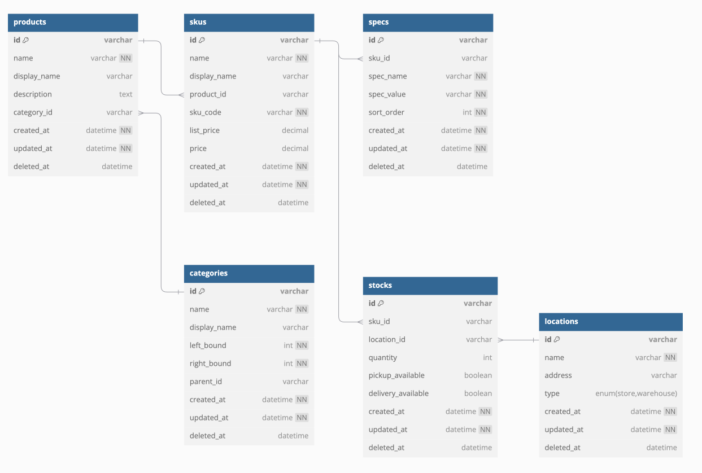

# catalog-app

## Summary

## Setting

### 1.Database

#### a) add .env file
```bash
$ touch ./.env
```

./.env
```dotenv
MYSQL_ROOT_PASSWORD=XXXX
MYSQL_USER=XXXX
MYSQL_PASSWORD=XXXX
```

#### b) docker compose up
```bash
$ docker compose up -d
```
Wait a few minutes...

### 2.API

- Run
```bash
$ cd api/ && ./mvnw spring-boot:run
```

- Browse  
http://localhost:8082/


## Schema

- Database(Port MySQL: 3308 / Redis: 6389)


- OAS３.0  
  http://localhost:8082/swagger-ui/index.html

